# 🧪 Apigee Innovation Lab


Welcome to my **Digital Laboratory**.
This repository acts as a monorepo for my journey to mastering **Google Cloud Apigee**. It contains multiple independent projects, experiments, and architectural patterns, ranging from simple proxies to complex security implementations.

---

## 📂 Project 1: Weather-Shield-Gateway
**Status:** ✅ Completed (v1.0) | **Path:** `./Weather-Shield-Gateway`

A fully functional, enterprise-grade API Proxy that demonstrates the core pillars of API Management: Security, Mediation, and Monetization.

### 🛠 Tech Stack


### 📐 Architecture & Logic
The project structure follows a modular design pattern to separate concerns.

| Module | Folder | Function |
| :--- | :--- | :--- |
| **Contract** | `01-API-Design` | **OpenAPI 3.0 Spec** defining the API surface and data models. |
| **Mediation** | `02-Mediation` | **Transformation & Optimization:** JSON conversion and Caching logic. |
| **Security** | `03-Security` | **Protection:** Spike Arrests, JWT Validation, and API Key checks. |
| **Governance** | `04-Monetization` | **Rate Limiting:** Enforcing Quotas (Silver Tier) for monetization. |
| **Wiring** | `05-Proxy-Wiring` | **Orchestration:** Connecting policies into `PreFlow`, `PostFlow`, and `FaultRules`. |

### 🔄 Execution Flow
When a client request hits the **Weather Shield**:

1.  **Ingest:** Apigee intercepts the call to `/weather-lab`.
2.  **PreFlow (Security Layer):**
    * ⛔️ **Spike Arrest:** Blocks traffic surges immediately.
    * 🛡️ **JWT Auth:** Validates the security token.
    * 📉 **Quota:** Deducts credits from the user's tier.
    * ⚡️ **Cache Check:** Returns data instantly if available.
3.  **Target:** Forwards request to `api.example.com` (if not cached).
4.  **PostFlow (Mediation Layer):**
    * 💾 **Cache Populate:** Saves response for future calls.
    * 📡 **Audit Log:** Fires a background log to an external server.
    * ✨ **Transform:** Converts backend XML to clean JSON.
5.  **Response:** Client receives the final payload.


### 🧩 API Request Flow [Visual Diagram for better Explanation]

The following diagram illustrates the request and response lifecycle for the `/weather-lab` endpoint managed by Google Cloud Apigee.

```mermaid
flowchart TB
 subgraph PreFlow["Request Pipeline"]
    direction TB
    Spike{"⛔️ Spike Arrest"}
    JWT{"🛡️ Verify JWT"}
    Quota{"📉 Check Quota"}
    CacheCheck{"⚡️ Cache Hit?"}
 end
 subgraph External["External Systems"]
    Backend["☁️ Weather API"]
    LogServer["📝 Audit Log Server"]
 end
 subgraph PostFlow["Response Pipeline"]
    direction TB
    CachePop["💾 Populate Cache"]
    LogCall["📡 Service Callout"]
    Transform["✨ XML to JSON"]
 end

    Client(["👤 Client"]) -- "GET /weather-lab" --> Apigee["Google Cloud Apigee"]
    Apigee --> Spike
    Spike -- Pass --> JWT
    JWT -- Valid --> Quota
    Quota -- Limit OK --> CacheCheck
    CacheCheck -- No --> Backend
    CacheCheck -- Yes --> LogCall
    Backend -- Response --> CachePop
    CachePop --> LogCall
    LogCall --> Transform
    Transform -- JSON Payload --> Client
    LogCall -. Async .-> LogServer
    
    style Apigee fill:#f9f,stroke:#333
    style Backend fill:#bbf,stroke:#333
```

### 🌊 Flow Description of Visual Diagram

1.  **Request Pipeline (PreFlow):**
    * **Traffic Management:** The proxy first applies a **Spike Arrest** policy to protect against traffic surges.
    * **Security:** It validates the user's identity using **JWT Verification**.
    * **Quota Enforcement:** A **Quota** check ensures the client hasn't exceeded their API limits.
    * **Caching:** The system checks if a valid response already exists in the cache to reduce latency.

2.  **External Routing:**
    * If there is a **Cache Miss**, the request is routed to the backend **Weather API**.
    * If there is a **Cache Hit**, the backend call is bypassed.

3.  **Response Pipeline (PostFlow):**
    * **Cache Population:** Fresh responses from the backend are stored in the cache for future use.
    * **Logging:** An asynchronous **Service Callout** sends transaction details to the Audit Log Server without blocking the main response.
    * **Transformation:** Finally, the XML response from the backend is converted to **JSON** before being sent back to the client.
---
### ☁️ Deployment Guide

*This bundle is structured for Portfolio/Learning purposes. To deploy to Google Cloud Apigee X:*

1.  **Prepare the Artifact:**
    * Create a local folder named `apiproxy`.
    * Inside it, create folders: `proxies`, `targets`, `policies`.
    * **Copy** all XML policies from `02`, `03`, `04` into `policies/`.
    * **Copy** endpoints from `05` into `proxies/` and `targets/`.
    * **Copy** `weather-proxy.xml` to the root of `apiproxy/`.
    * **Zip** the `apiproxy` folder (Result: `apiproxy.zip`).

2.  **Upload to Cloud:**
    * Go to **Google Cloud Console > Apigee > API Proxies**.
    * Click **Create New** -> **Upload Proxy Bundle**.
    * Select `apiproxy.zip`.

3.  **Deploy:**
    * Select the **eval** environment.
    * Click **Deploy**.

4.  **Verify:**
    * **Step 1:** Generate a test JWT at [jwt.io](https://jwt.io) using the secret: `MySecretSigningKey123`.
    * **Step 2 (Option A - Postman):**
        * Create a **GET** request to `https://[YOUR-URL]/weather-lab?city=London`.
        * Go to **Headers** tab.
        * Add Key: `Authorization`, Value: `Bearer <PASTE_YOUR_JWT>`.
        * Click **Send**.
    * **Step 2 (Option B - Terminal):**
        * Call the endpoint:
        ```bash
        curl -H "Authorization: Bearer <JWT>" "https://[YOUR-URL]/weather-lab?city=London"
        ```
---
*Created & Maintained by [Sunny JayaRaj](https://github.com/SunnyJayaRaj)*
