# 🧪 Apigee Innovation Lab


Welcome to my **Digital Laboratory**.
This repository acts as a monorepo for my journey to mastering **Google Cloud Apigee**. It contains multiple independent projects, experiments, and architectural patterns, ranging from simple proxies to complex security implementations.

---

## 📂 Project 1: Weather-Shield-Gateway
**Status:** ✅ Completed (v1.0) | **Path:** `./Weather-Shield-Gateway`

A fully functional, enterprise-grade API Proxy that demonstrates the core pillars of API Management: Security, Mediation, and Monetization.

### 🛠 Tech Stack


### 📐 Architecture & Logic
The project structure follows a modular design pattern to separate concerns.

| Module | Folder | Function |
| :--- | :--- | :--- |
| **Contract** | `01-API-Design` | **OpenAPI 3.0 Spec** defining the API surface and data models. |
| **Mediation** | `02-Mediation` | **Transformation & Optimization:** JSON conversion and Caching logic. |
| **Security** | `03-Security` | **Protection:** Spike Arrests, JWT Validation, and API Key checks. |
| **Governance** | `04-Monetization` | **Rate Limiting:** Enforcing Quotas (Silver Tier) for monetization. |
| **Wiring** | `05-Proxy-Wiring` | **Orchestration:** Connecting policies into `PreFlow`, `PostFlow`, and `FaultRules`. |

### 🔄 Execution Flow
When a client request hits the **Weather Shield**:

1.  **Ingest:** Apigee intercepts the call to `/weather-lab`.
2.  **PreFlow (Security Layer):**
    * ⛔️ **Spike Arrest:** Blocks traffic surges immediately.
    * 🛡️ **JWT Auth:** Validates the security token.
    * 📉 **Quota:** Deducts credits from the user's tier.
    * ⚡️ **Cache Check:** Returns data instantly if available.
3.  **Target:** Forwards request to `api.example.com` (if not cached).
4.  **PostFlow (Mediation Layer):**
    * 💾 **Cache Populate:** Saves response for future calls.
    * 📡 **Audit Log:** Fires a background log to an external server.
    * ✨ **Transform:** Converts backend XML to clean JSON.
5.  **Response:** Client receives the final payload.


### 🧩 Visual Diagram: API Request Flow

The following diagram illustrates the request and response lifecycle for the `/weather-lab` endpoint managed by Google Cloud Apigee.

```mermaid
sequenceDiagram
    autonumber
    participant Client as 👤 Client
    participant Apigee as 🛡️ Apigee Edge
    participant Auth as 🔐 Security/Quota
    participant Backend as ☁️ Weather API
    participant LogServer as 📝 Audit Log

    Note over Client, Apigee: Inbound Request
    Client->>Apigee: GET /weather-lab
    Apigee->>Apigee: ⛔️ Spike Arrest Check
    
    Apigee->>Auth: 🛡️ Verify JWT & 📉 Check Quota
    Auth-->>Apigee: Allowed
    
    Note over Apigee, Backend: Routing Logic
    Apigee->>Apigee: ⚡️ Check Cache
    
    alt Cache Miss (Data not found)
        Apigee->>Backend: Fetch Weather Data
        Backend-->>Apigee: Return XML Response
        Apigee->>Apigee: 💾 Populate Cache
    else Cache Hit (Data found)
        Apigee-->>Apigee: Retrieve from Memory
    end

    Note over Apigee, Client: Response Processing
    par Async Logging
        Apigee-)LogServer: 📡 Service Callout (Fire & Forget)
    and Transformation
        Apigee->>Apigee: ✨ Convert XML to JSON
    end
    
    Apigee-->>Client: 200 OK (JSON Payload)
```

### 🌊 Flow Description of Visual Diagram

1.  **Request Pipeline (PreFlow):**
    * **Traffic Management:** The proxy first applies a **Spike Arrest** policy to protect against traffic surges.
    * **Security:** It validates the user's identity using **JWT Verification**.
    * **Quota Enforcement:** A **Quota** check ensures the client hasn't exceeded their API limits.
    * **Caching:** The system checks if a valid response already exists in the cache to reduce latency.

2.  **External Routing:**
    * If there is a **Cache Miss**, the request is routed to the backend **Weather API**.
    * If there is a **Cache Hit**, the backend call is bypassed.

3.  **Response Pipeline (PostFlow):**
    * **Cache Population:** Fresh responses from the backend are stored in the cache for future use.
    * **Logging:** An asynchronous **Service Callout** sends transaction details to the Audit Log Server without blocking the main response.
    * **Transformation:** Finally, the XML response from the backend is converted to **JSON** before being sent back to the client.
---
### ☁️ Deployment Guide

*This bundle is structured for Portfolio/Learning purposes. To deploy to Google Cloud Apigee X:*

1.  **Prepare the Artifact:**
    * Create a local folder named `apiproxy`.
    * Inside it, create folders: `proxies`, `targets`, `policies`.
    * **Copy** all XML policies from `02`, `03`, `04` into `policies/`.
    * **Copy** endpoints from `05` into `proxies/` and `targets/`.
    * **Copy** `weather-proxy.xml` to the root of `apiproxy/`.
    * **Zip** the `apiproxy` folder (Result: `apiproxy.zip`).

2.  **Upload to Cloud:**
    * Go to **Google Cloud Console > Apigee > API Proxies**.
    * Click **Create New** -> **Upload Proxy Bundle**.
    * Select `apiproxy.zip`.

3.  **Deploy:**
    * Select the **eval** environment.
    * Click **Deploy**.

4.  **Verify:**
    * **Step 1:** Generate a test JWT at [jwt.io](https://jwt.io) using the secret: `MySecretSigningKey123`.
    * **Step 2 (Option A - Postman):**
        * Create a **GET** request to `https://[YOUR-URL]/weather-lab?city=London`.
        * Go to **Headers** tab.
        * Add Key: `Authorization`, Value: `Bearer <PASTE_YOUR_JWT>`.
        * Click **Send**.
    * **Step 2 (Option B - Terminal):**
        * Call the endpoint:
        ```bash
        curl -H "Authorization: Bearer <JWT>" "https://[YOUR-URL]/weather-lab?city=London"
        ```
---
## 📂 Project 2: Secure-Bank-Access
**Status:** ✅ Completed (v1.0) | **Path:** `./Secure-Bank-Access`

A simulation of a Banking API focused on **Identity & Access Management (IAM)**.
This project implements the **OAuth 2.0 Client Credentials** flow to secure sensitive financial data.

### 🛠 Tech Stack


### 📐 Architecture & Logic
This proxy uses **Conditional Flows** to handle two distinct operations in one endpoint.

| Module | Folder | Function |
| :--- | :--- | :--- |
| **Contract** | `01-API-Design` | **OpenAPI 3.0 Spec** defining `/token` and `/balance` paths. |
| **Security** | `03-Security` | **OAuthV2 Policies:** One for generating tokens, one for verifying them. |
| **Wiring** | `05-Proxy-Wiring` | **Flow Logic:** Routes traffic based on URL (`/token` vs `/balance`). |

### 🧩 Visual Diagram: OAuth 2.0 Flow

```mermaid
sequenceDiagram
    autonumber
    participant Client as 👤 Client (Postman)
    participant Apigee as 🛡️ Apigee Edge
    participant Auth as 🔐 OAuth Store
    participant Backend as 🏦 Mock Backend

    Note over Client, Auth: Phase 1: The Handshake (Get the Badge)
    Client->>Apigee: POST /token (Client ID + Secret)
    Apigee->>Auth: Validate Credentials
    Auth-->>Apigee: Credentials Valid!
    Apigee->>Auth: Generate Access Token
    Auth-->>Apigee: Token: "z29t..."
    Apigee-->>Client: 200 OK {access_token: "z29t...", expires_in: 1800}

    Note over Client, Backend: Phase 2: The Access (Enter the Vault)
    Client->>Apigee: GET /balance (Authorization: Bearer z29t...)
    Apigee->>Apigee: Condition: /balance?
    Apigee->>Auth: Verify Token "z29t..."
    alt Token Invalid
        Auth-->>Apigee: Error (Expired/Fake)
        Apigee-->>Client: 401 Unauthorized
    else Token Valid
        Auth-->>Apigee: Success
        Apigee->>Backend: Request Account Data
        Backend-->>Apigee: JSON Response
        Apigee-->>Client: 200 OK {"balance": 5000}
    end
```  

### 🌊 Flow Description

The architecture implements a standard **OAuth 2.0 Client Credentials Grant** pattern, separated into two distinct phases:

**Phase 1: The Handshake (Authentication)**
* **Trigger:** The Client `POST`s their Client ID and Secret to the `/token` endpoint.
* **Validation:** Apigee checks these credentials against its internal Identity Store.
* **Minting:** If valid, Apigee generates a cryptographically signed **Access Token** with a 30-minute expiration.
* **Response:** The client receives the token (the "Badge") to use for future requests.

**Phase 2: The Access (Authorization)**
* **Gatekeeping:** The Client makes a `GET` request to the protected `/balance` endpoint, attaching the token in the `Authorization: Bearer` header.
* **Verification:** The Proxy intercepts the request *before* it reaches the backend. It checks:
    1.  Is the token signature valid?
    2.  Has the token expired?
    3.  Is the token revoked?
* **Routing:**
    * ⛔️ **Invalid:** The proxy returns `401 Unauthorized` immediately. The backend is never touched.
    * ✅ **Valid:** The proxy forwards the request to the Banking Backend to retrieve account data.
---
### ☁️ Deployment Guide

*This bundle relies on Apigee's internal identity store (App/Product/Developer).*

1.  **Deploy the Proxy:**
    * Create a local folder named `apiproxy`.
    * Inside it, create folders: `proxies`, `targets`, `policies`.
    * **Copy** all XML policies from `03-Security` into `policies/`.
    * **Copy** endpoints from `05-Proxy-Wiring` into `proxies/` and `targets/`.
    * **Copy** `bank-proxy.xml` to the root of `apiproxy/`.
    * **Zip** the `apiproxy` folder.
    * Upload to **Google Cloud Console** and deploy to `eval`.

2.  **Configure Infrastructure:**
    * **API Product:** Create a Product named "Banking-Premium" (Access: Public, Scopes: All).
    * **Developer:** Create a dummy developer (e.g., `fintech@example.com`).
    * **App:** Create an App, select the Developer, and add the "Banking-Premium" Product.
    * **Keys:** Copy the generated **Client ID** and **Client Secret**.

3.  **Verify:**
    * **Get Token:** POST your ID/Secret to `https://[YOUR-URL]/bank-v1/token`.
    * **Access Data:** Use the returned token to GET `https://[YOUR-URL]/bank-v1/balance`.
---
## 📂 Project 3: Retail-Mesh-Orchestrator
**Status:** ✅ Completed (v1.0) | **Path:** `./Retail-Mesh-Orchestrator`

An advanced **API Composition** project.
Instead of simply proxying traffic, this API acts as an **Orchestrator**, making parallel calls to multiple backends and merging the data using JavaScript logic before responding to the client.

### 🛠 Tech Stack


### 📐 Architecture & Logic
This proxy implements the **API Composition Pattern** (sometimes called "Backend for Frontend").

| Module | Folder | Function |
| :--- | :--- | :--- |
| **Contract** | `01-API-Design` | **OpenAPI 3.0 Spec** for composite product data. |
| **Mediation** | `02-Mediation` | **Service Callout:** Fetches inventory. **JavaScript:** Merges JSON. |
| **Wiring** | `05-Proxy-Wiring` | **Flow Logic:** Orchestrates the sequence of calls. |

### 🧩 Visual Diagram: API Composition Flow

### 🌊 Flow Description

1.  **Request Ingest:** The client requests a composite resource (`/product/555`).
2.  **Main Target:** The proxy forwards the request to the **Product Catalog** to get descriptions and pricing.
3.  **Side Request (Service Callout):** *While* the main request is happening (or immediately after), the proxy makes a separate HTTP call to the **Inventory Service** to check stock levels.
4.  **Data Holding:** Both responses are stored in flow variables (`response.content` and `inventoryResponse`).
5.  **The Mashup (JavaScript):** A custom JS script executes to:
    * Parse both JSON payloads.
    * Extract relevant fields.
    * Construct a new, unified JSON object.
6.  **Final Response:** The composite object is returned to the client.

### ☁️ Deployment Guide
*Requires special folder structure for scripts.*

1.  **Build:**
    * Create a local `apiproxy` folder structure.
    * **Crucial Step:** Place `Mashup-Logic.js` inside `apiproxy/resources/jsc/`.
    * Place all other XML policies in `apiproxy/policies/`.
    * Zip the folder.

2.  **Deploy:** Upload to **Google Cloud Apigee** and deploy to `eval`.

3.  **Verify:**
    * `GET https://[YOUR-URL]/retail-v1/product/555`
    * **Expected Result:** A merged JSON response containing both Product and Inventory data.
---
## 📂 Project 4: Apigee-DevOps-Pipeline
**Status:** ✅ Completed (CI Phase) | **Path:** `./Apigee-DevOps-Pipeline`

A demonstration of **Automated Continuous Integration (CI)**.
This project moves away from manual console deployments. It uses **GitHub Actions** to automatically lint, bundle, and package the proxy whenever code is pushed to the repository.

### 🛠 Tech Stack


### 📐 Architecture & Logic
The pipeline creates a "Quality Gate" that prevents bad code from reaching production.

| Stage | Action | Function |
| :--- | :--- | :--- |
| **1. Build** | `mkdir` & `cp` | **Standardization:** Converts the raw repo structure into a valid `apiproxy` bundle. |
| **2. Lint** | `apigeelint` | **Static Analysis:** Scans XML and JS files for syntax errors and best practice violations. |
| **3. Package** | `zip` | **Artifact Creation:** Compresses the validated code into a deployable `apiproxy.zip` file. |
| **4. Simulation** | `echo` | **CD Mock:** Simulates the cloud handshake (Deployment is currently manual due to env constraints). |

### 🧩 Visual Diagram: CI/CD Pipeline

```mermaid
graph LR
    Push[git push] --> GitHub[GitHub Actions]
    GitHub --> Build[🏗 Build Structure]
    Build --> Lint[🔍 Lint Check]
    
    Lint -- Fail --> Stop[⛔️ Stop Pipeline]
    Lint -- Pass --> Zip[📦 Create Zip]
    
    Zip --> Upload[⬆️ Upload Artifact]
    Upload --> Deploy[🚀 Mock Deployment]
```

### 🌊 Flow Description
The pipeline automates the software delivery lifecycle in three distinct phases:

**Phase 1: Trigger & Setup**
* **Event:** A developer pushes code to the `main` branch.
* **Initialization:** GitHub Actions provisions a fresh Ubuntu runner and installs the necessary runtime (Node.js) to execute the workflow.

**Phase 2: The Quality Gate (CI)**
* **Build:** The system dynamically assembles the `apiproxy` folder structure from the source files.
* **Linting:** The `apigeelint` tool performs a deep scan of the XML configuration.
    * ⛔️ **Failure:** If syntax errors or anti-patterns are found, the pipeline halts immediately, preventing broken code from progressing.
    * ✅ **Success:** If the code is clean, the pipeline proceeds to packaging.

**Phase 3: Delivery (Artifacts)**
* **Packaging:** The validated bundle is compressed into a standard `apiproxy.zip` file.
* **Artifact Upload:** This zip file is uploaded to GitHub Storage, allowing the developer to download the "Ready-to-Deploy" bundle.
* **Simulation:** The workflow concludes by simulating the final handoff to Google Cloud (Deployment).

### ☁️ Deployment Guide
*This pipeline automates the Build and Verify stages.*

1.  **Push Code:**
    * Commit your changes and push to `main`.
    * `git push origin main`

2.  **Monitor Pipeline:**
    * Go to the **Actions** tab in GitHub.
    * Click on the latest workflow run.
    * Verify all steps have **Green Checkmarks** ✅.

3.  **Download Artifact:**
    * Scroll to the "Artifacts" section of the workflow summary.
    * Download **deployable-bundle**.
    * This zip file is verified and ready for manual upload to Google Cloud Apigee if needed.
---
*Created & Maintained by [Sunny JayaRaj](https://github.com/SunnyJayaRaj)*
