# 🧪 Apigee Innovation Lab

Welcome to my **Digital Laboratory**.
This repository acts as a monorepo for my journey to mastering **Google Cloud Apigee**. It contains multiple independent projects, experiments, and architectural patterns, ranging from simple proxies to complex security implementations.

---

## 📂 Project 1: Weather-Shield-Gateway
**Status:** ✅ Completed (v1.0) | **Path:** `./Weather-Shield-Gateway`

A fully functional, enterprise-grade API Proxy that demonstrates the core pillars of API Management: Security, Mediation, and Monetization.

### 🛠 Tech Stack

### 📐 Architecture & Logic
The project structure follows a modular design pattern to separate concerns.

| Module | Folder | Function |
| :--- | :--- | :--- |
| **Contract** | `01-API-Design` | **OpenAPI 3.0 Spec** defining the API surface and data models. |
| **Mediation** | `02-Mediation` | **Transformation & Optimization:** JSON conversion and Caching logic. |
| **Security** | `03-Security` | **Protection:** Spike Arrests, JWT Validation, and API Key checks. |
| **Governance** | `04-Monetization` | **Rate Limiting:** Enforcing Quotas (Silver Tier) for monetization. |
| **Wiring** | `05-Proxy-Wiring` | **Orchestration:** Connecting policies into `PreFlow`, `PostFlow`, and `FaultRules`. |

### 🔄 Execution Flow
When a client request hits the **Weather Shield**:

1.  **Ingest:** Apigee intercepts the call to `/weather-lab`.
2.  **PreFlow (Security Layer):**
    * ⛔️ **Spike Arrest:** Blocks traffic surges immediately.
    * 🛡️ **JWT Auth:** Validates the security token.
    * 📉 **Quota:** Deducts credits from the user's tier.
    * ⚡️ **Cache Check:** Returns data instantly if available.
3.  **Target:** Forwards request to `api.example.com` (if not cached).
4.  **PostFlow (Mediation Layer):**
    * 💾 **Cache Populate:** Saves response for future calls.
    * 📡 **Audit Log:** Fires a background log to an external server.
    * ✨ **Transform:** Converts backend XML to clean JSON.
5.  **Response:** Client receives the final payload.

### 🧩 Visual Diagram

```mermaid
graph TD
    Client([👤 Client]) -->|GET /weather-lab| Apigee[Google Cloud Apigee]
    
    subgraph PreFlow [Request Pipeline]
        Spike{⛔️ Spike Arrest} -->|Pass| JWT{🛡️ Verify JWT}
        JWT -->|Valid| Quota{📉 Check Quota}
        Quota -->|Limit OK| CacheCheck{⚡️ Cache Hit?}
    end
    
    subgraph External [External Systems]
        Backend[☁️ Weather API]
        LogServer[📝 Audit Log Server]
    end
    
    subgraph PostFlow [Response Pipeline]
        CachePop[💾 Populate Cache] --> LogCall[📡 Service Callout]
        LogCall --> Transform[✨ XML to JSON]
    end

    Apigee --> Spike
    CacheCheck -->|No| Backend
    CacheCheck -->|Yes| LogCall
    Backend -->|Response| CachePop
    
    LogCall -.->|Async Logging| LogServer
    Transform -->|JSON Payload| Client
    
    style Apigee fill:#f9f,stroke:#333,stroke-width:2px
    style Backend fill:#bbf,stroke:#333,stroke-width:2px
```

---
### ☁️ Deployment

*This bundle is structured for Portfolio/Learning. For production deployment, reorganise into a standard `apiproxy/` structure.*

To deploy this specific project:
1.  Navigate to the `Weather-Shield-Gateway` folder.
2.  Zip the contents (ensure `weather-proxy.xml` is at the root of the zip).
3.  Import as a new Proxy in **Google Cloud Apigee Console**.
4.  Deploy to the test environment.
---
*Created & Maintained by [Sunny JayaRaj](https://github.com/SunnyJayaRaj)*
